## Overview

Mempool provides official one-click installations for popular Bitcoin node distributions. These solutions are ideal for home users who want to run their own Mempool instance without manual server configuration.

<Info>
  **Recommended for most users**: These distributions handle all the complexity of running Bitcoin Core, Electrum Server, and Mempool for you.
</Info>

## Supported Node Distros

<CardGroup cols={3}>
  <Card title="Umbrel" icon="umbrella" color="#5351FB">
    Most popular plug-and-play node
  </Card>
  
  <Card title="RaspiBlitz" icon="bolt" color="#F7931A">
    Lightning-focused Raspberry Pi distro
  </Card>
  
  <Card title="StartOS" icon="rocket" color="#0066FF">
    Privacy-focused sovereign computing
  </Card>
  
  <Card title="myNode" icon="node" color="#00A8E8">
    Premium Bitcoin & Lightning node
  </Card>
  
  <Card title="RoninDojo" icon="shield" color="#D52128">
    Privacy-enhanced Samourai node
  </Card>
  
  <Card title="nix-bitcoin" icon="snowflake" color="#5277C3">
    Reproducible node deployment
  </Card>
</CardGroup>

<Warning>
  All these distributions require their own hardware setup. See [Requirements](/self-hosting/requirements) for hardware specifications.
</Warning>

---

## Umbrel

### Overview

[Umbrel](https://umbrel.com) is the most popular personal server OS for running Bitcoin, Lightning, and self-hosted apps. It features a beautiful app store interface and is the easiest way to self-host Mempool.

<CardGroup cols={2}>
  <Card title="Hardware Support">
    - Raspberry Pi 4 (4GB/8GB)
    - Umbrel Home (official hardware)
    - Most x86_64 PCs
    - Any Debian/Ubuntu system
  </Card>
  
  <Card title="Features">
    - One-click app installation
    - Automatic updates
    - Tor support included
    - Beautiful web interface
  </Card>
</CardGroup>

### Installation

<Steps>
  <Step title="Install Umbrel">
    Follow the [official Umbrel installation guide](https://umbrel.com/docs) for your hardware.
    
    Quick start for Raspberry Pi:
    ```bash
    # Flash Umbrel OS to microSD card
    # Visit http://umbrel.local after boot
    ```
  </Step>
  
  <Step title="Open App Store">
    Navigate to the Umbrel App Store in your browser at `http://umbrel.local`
  </Step>
  
  <Step title="Install Bitcoin Core">
    Install Bitcoin Core from the App Store (required dependency)
    
    <Info>Initial sync will take 1-3 days depending on your hardware</Info>
  </Step>
  
  <Step title="Install Electrs (Recommended)">
    Install Electrs (Electrum Server) for full address lookup support
    
    <Warning>Electrs indexing can take several days on Raspberry Pi</Warning>
  </Step>
  
  <Step title="Install Mempool">
    Search for "Mempool" in the App Store and click Install
    
    The app will automatically:
    - Connect to Bitcoin Core
    - Connect to Electrs (if installed)
    - Set up MariaDB database
    - Configure and start all services
  </Step>
  
  <Step title="Access Your Instance">
    Once installed, access Mempool at:
    - Local: `http://umbrel.local:3006`
    - Tor: Available in app details
  </Step>
</Steps>

### Configuration

Umbrel handles all configuration automatically. Advanced users can access container config:

```bash Advanced Configuration
# SSH into Umbrel
ssh umbrel@umbrel.local

# View Mempool logs
~/umbrel/app-data/mempool/data/docker-compose.yml

# Restart Mempool
cd ~/umbrel/apps/mempool
docker-compose restart
```

### Troubleshooting

<AccordionGroup>
  <Accordion title="Mempool shows no transactions">
    **Cause**: Bitcoin Core is still syncing
    
    **Solution**: Wait for Bitcoin Core sync to complete. Check progress in Bitcoin Core app.
  </Accordion>
  
  <Accordion title="Address lookup not working">
    **Cause**: Electrs is not installed or still indexing
    
    **Solution**: Install Electrs from App Store and wait for indexing to complete (several days).
  </Accordion>
  
  <Accordion title="App won't start">
    **Cause**: Low disk space or memory
    
    **Solution**: 
    - Ensure 1TB+ storage available
    - Raspberry Pi needs 8GB RAM for best results
    - Restart Umbrel system
  </Accordion>
</AccordionGroup>

---

## RaspiBlitz

### Overview

[RaspiBlitz](https://raspiblitz.org) is a DIY Bitcoin & Lightning node project optimized for Raspberry Pi. It's designed for makers who want full control over their node.

<CardGroup cols={2}>
  <Card title="Hardware">
    - Raspberry Pi 4 (4GB/8GB RAM)
    - 1TB+ SSD
    - Official RaspiBlitz LCD (optional)
    - Power supply
  </Card>
  
  <Card title="Highlights">
    - Terminal-based configuration
    - Extensive Lightning tools
    - Advanced user features
    - Active community support
  </Card>
</CardGroup>

### Installation

<Steps>
  <Step title="Set Up RaspiBlitz">
    Follow the [RaspiBlitz setup guide](https://github.com/rootzoll/raspiblitz):
    
    1. Flash RaspiBlitz image to microSD
    2. Boot Raspberry Pi
    3. Follow LCD/web setup wizard
    4. Wait for Bitcoin blockchain sync
  </Step>
  
  <Step title="Enable Electrs">
    From the RaspiBlitz main menu:
    
    ```bash
    SERVICES > Electrum Rust Server (electrs) > ON
    ```
    
    <Note>Electrs will begin indexing automatically</Note>
  </Step>
  
  <Step title="Install Mempool">
    From the main menu:
    
    ```bash  
    SERVICES > Mempool Space Explorer > ON
    ```
    
    RaspiBlitz will:
    - Install Docker if needed
    - Deploy Mempool containers
    - Configure networking
    - Set up Tor hidden service
  </Step>
  
  <Step title="Access Mempool">
    Access options:
    - **Local Network**: `http://raspiblitz.local:4080`
    - **Tor**: Check SERVICES menu for .onion address
    - **LCD**: Shows access info
  </Step>
</Steps>

### Configuration Files

RaspiBlitz stores Mempool data in:

```bash File Locations
# Mempool configuration
/mnt/hdd/app-data/mempool/

# Docker compose
/mnt/hdd/app-data/mempool/docker-compose.yml

# View logs
sudo docker logs mempool-web
sudo docker logs mempool-api
sudo docker logs mempool-db
```

### CLI Commands

```bash Useful Commands
# Restart Mempool
sudo systemctl restart mempool

# Check status
sudo systemctl status mempool

# View config
cat /mnt/hdd/app-data/mempool/mempool-config.json

# Update Mempool
# Use SERVICES menu > Mempool > UPDATE
```

---

## StartOS (formerly Embassy)

### Overview

[StartOS](https://start9.com) is a sovereign computing platform focused on privacy and ease of use. It provides a marketplace for self-hosted services.

<CardGroup cols={2}>
  <Card title="Hardware Options">
    - Start9 Server (official)
    - Raspberry Pi 4/5
    - Most x86_64 computers
    - Virtual machines
  </Card>
  
  <Card title="Key Features">
    - Graphical interface
    - Service dependencies
    - Health monitoring
    - Automatic backups
  </Card>
</CardGroup>

### Installation

<Steps>
  <Step title="Install StartOS">
    Install StartOS following the [official guide](https://docs.start9.com/)
    
    Access your server at `https://start9-xxxxxx.local`
  </Step>
  
  <Step title="Install Bitcoin Core">
    From the Marketplace:
    1. Search for "Bitcoin Core"
    2. Click Install
    3. Configure and start service
    4. Wait for initial blockchain download
  </Step>
  
  <Step title="Install Electrs">
    1. Search for "Electrs" in Marketplace
    2. Install and configure
    3. Service will auto-connect to Bitcoin Core
    4. Wait for indexing (days to weeks)
  </Step>
  
  <Step title="Install Mempool">
    1. Search for "Mempool" in Marketplace
    2. Click Install
    3. StartOS automatically configures dependencies
    4. Service starts automatically
  </Step>
  
  <Step title="Configure Access">
    StartOS provides:
    - Local LAN interface
    - Tor hidden service (automatic)
    - Optional external domain
  </Step>
</Steps>

### Service Dependencies

StartOS automatically manages service dependencies:

```mermaid
graph TD
    A[Mempool] --> B[Bitcoin Core]
    A --> C[Electrs]
    A --> D[MariaDB]
    C --> B
    
    style A fill:#0066FF
    style B fill:#F7931A
    style C fill:#7B42BC
    style D fill:#003545
```



### Health Monitoring

StartOS provides built-in health checks:
- Service status
- Dependency health
- Resource usage
- Error logs

---

## myNode

### Overview

[myNode](https://mynodebtc.com) is a premium Bitcoin node solution with both free (Community) and paid (Premium) versions.

<CardGroup cols={2}>
  <Card title="Community Edition">
    Free and open source
    
    - Core Bitcoin/Lightning apps
    - Basic Mempool instance
    - Manual updates
  </Card>
  
  <Card title="Premium Edition">
    $99 one-time or subscription
    
    - Additional apps
    - One-click updates
    - Priority support
    - Advanced features
  </Card>
</CardGroup>

### Installation

<Steps>
  <Step title="Get myNode">
    Options:
    - Purchase myNode device with pre-installed software
    - [Install on Raspberry Pi](https://mynodebtc.com/download)
    - Install on existing Linux system
  </Step>
  
  <Step title="Initial Setup">
    1. Boot device and access web UI
    2. Create admin password
    3. Wait for Bitcoin sync
  </Step>
  
  <Step title="Enable Mempool">
    From myNode web interface:
    
    1. Navigate to Applications
    2. Find "Mempool Viewer"
    3. Click Enable/Install
    4. Wait for setup to complete
  </Step>
  
  <Step title="Access">
    - Web: `http://mynode.local/mempool`
    - Direct: `http://mynode.local:4080`
  </Step>
</Steps>

### Premium Features

Premium edition includes:
- One-click Mempool updates
- Integrated backup/restore
- Advanced monitoring
- UI themes and customization

---

## RoninDojo

### Overview

[RoninDojo](https://ronindojo.io) is a privacy-focused node implementation designed for use with Samourai Wallet. It includes enhanced privacy tools.

<CardGroup cols={2}>
  <Card title="Privacy Focus">
    - Whirlpool coordinator
    - Dojo backend
    - Boltzmann calculator
    - Privacy analytics
  </Card>
  
  <Card title="Hardware">
    - RoninDojo Tanto (official)
    - Odroid N2+
    - Raspberry Pi 4
    - x86_64 systems
  </Card>
</CardGroup>

### Installation

<Steps>
  <Step title="Install RoninDojo">
    Follow the [RoninDojo installation guide](https://wiki.ronindojo.io/en/setup)
    
    Flash image and boot device
  </Step>
  
  <Step title="Run RoninDojo Setup">
    SSH into device:
    ```bash
    ssh ronindojo@ronindojo.local
    # Default password: ronindojo
    ```
    
    Run welcome wizard
  </Step>
  
  <Step title="Install Mempool">
    From RoninDojo menu:
    ```bash
    Manage > Applications > Install Mempool
    ```
  </Step>
  
  <Step title="Configure Network">
    Mempool accessible via:
    - Local: Port 4080
    - Tor: Generated .onion address
  </Step>
</Steps>

### Integration with Samourai

Mempool on RoninDojo integrates with:
- Samourai Wallet
- Whirlpool CoinJoin
- Dojo backend
- Transaction tracking

---

## nix-bitcoin

### Overview

[nix-bitcoin](https://github.com/fort-nix/nix-bitcoin) is a collection of Nix packages for running Bitcoin nodes and services with reproducible builds.

<Note>
  nix-bitcoin is for advanced users comfortable with NixOS and declarative configuration.
</Note>

### Installation

<Steps>
  <Step title="Set Up NixOS">
    Install NixOS on your target system
  </Step>
  
  <Step title="Add nix-bitcoin">
    Add nix-bitcoin to your configuration:
    
    ```nix flake.nix
    {
      inputs.nix-bitcoin.url = "github:fort-nix/nix-bitcoin/release";
    }
    ```
  </Step>
  
  <Step title="Enable Mempool">
    Add to `configuration.nix`:
    
    ```nix configuration.nix
    {
      services.mempool = {
        enable = true;
        address = "0.0.0.0";
        port = 4080;
      };
      
      # Enable dependencies
      services.bitcoind.enable = true;
      services.electrs.enable = true;
    }
    ```
  </Step>
  
  <Step title="Deploy Configuration">
    ```bash
    sudo nixos-rebuild switch
    ```
  </Step>
</Steps>

### Declarative Configuration

nix-bitcoin allows complete declarative control:

```nix Example Configuration
{ config, pkgs, ... }:
{
  services.mempool = {
    enable = true;
    
    # Network settings
    address = "127.0.0.1";
    port = 4080;
    
    # Bitcoin connection
    bitcoind = {
      enable = true;
      rpc.users.mempool = {
        passwordHMAC = "...";
      };
    };
    
    # Electrs backend
    electrs.enable = true;
  };
  
  # Expose via Tor
  services.tor.hiddenServices.mempool = {
    version = 3;
    map = [{ port = 80; toPort = 4080; }];
  };
}
```

---

## Comparison Matrix

| Feature | Umbrel | RaspiBlitz | StartOS | myNode | RoninDojo | nix-bitcoin |
|---------|--------|------------|---------|--------|-----------|-------------|
| **Ease of Use** | ⭐⭐⭐⭐⭐ | ⭐⭐⭐ | ⭐⭐⭐⭐ | ⭐⭐⭐⭐ | ⭐⭐⭐ | ⭐⭐ |
| **Web Interface** | Yes | Limited | Yes | Yes | Yes | No |
| **Auto Updates** | Yes | Manual | Yes | Premium | Manual | NixOS |
| **Tor Support** | Built-in | Built-in | Built-in | Built-in | Built-in | Configure |
| **ARM Support** | Yes | Yes | Yes | Yes | Yes | Yes |
| **Target User** | Everyone | Makers | Privacy | Premium | Samourai | Experts |
| **Cost** | Free | Free | Free | $99 | Free | Free |

## Performance Comparison

<Note>
  Performance varies based on hardware, but generally:
</Note>

### Initial Sync Times (Raspberry Pi 4, 8GB)

| Component | Umbrel | RaspiBlitz | StartOS |
|-----------|--------|------------|----------|
| Bitcoin Core | 2-3 days | 2-3 days | 2-3 days |
| Electrs | 7-14 days | 7-14 days | 10-14 days |
| Mempool | 10 minutes | 10 minutes | 15 minutes |

### Resource Usage

```yaml Typical Resource Consumption
Raspberry Pi 4 (8GB):
  CPU: 10-30% average
  RAM: 4-6GB used
  Disk I/O: Moderate
  Network: ~100GB/month
  
x86_64 PC (16GB):
  CPU: 5-15% average  
  RAM: 6-10GB used
  Disk I/O: Higher
  Network: ~200GB/month
```

## Choosing the Right Distro

<CardGroup cols={2}>
  <Card title="Choose Umbrel if..." icon="check">
    - You want the easiest setup
    - You prefer a modern web UI
    - You're new to Bitcoin nodes
    - You want automatic updates
  </Card>
  
  <Card title="Choose RaspiBlitz if..." icon="check">
    - You want hands-on control
    - You need extensive Lightning tools
    - You like terminal interfaces
    - You're a maker/tinkerer
  </Card>
  
  <Card title="Choose StartOS if..." icon="check">
    - Privacy is your top priority
    - You want professional support
    - You need service health monitoring
    - You value sovereignty
  </Card>
  
  <Card title="Choose myNode if..." icon="check">
    - You want premium features
    - You prefer polished UX
    - You need priority support
    - Budget allows for premium
  </Card>
</CardGroup>

## Common Issues Across Distros

<AccordionGroup>
  <Accordion title="Slow initial sync">
    **Normal**: Bitcoin blockchain sync takes days
    
    **Optimize**:
    - Use fast SSD/NVMe drive
    - Ensure good internet connection
    - Increase `dbcache` in Bitcoin config
    - Consider downloading chain snapshot (advanced)
  </Accordion>
  
  <Accordion title="Electrs indexing never completes">
    **Cause**: Insufficient resources or disk space
    
    **Fix**:
    - Ensure 1TB+ free space
    - Close other apps
    - Be patient (can take 2+ weeks on Pi)
    - Consider disabling address lookups
  </Accordion>
  
  <Accordion title="Cannot access web interface">
    **Troubleshoot**:
    1. Check device is powered on
    2. Verify network connection
    3. Try IP address instead of hostname
    4. Check firewall rules
    5. Restart device
  </Accordion>
  
  <Accordion title="Low disk space warnings">
    **Solution**:
    - Delete unnecessary apps
    - Prune Bitcoin (if configured)
    - Upgrade to larger SSD
    - Disable debug logging
  </Accordion>
</AccordionGroup>

## Next Steps

<CardGroup cols={2}>
  <Card
    title="Requirements"
    icon="server"
    href="/self-hosting/requirements"
  >
    Verify your hardware meets requirements
  </Card>
  
  <Card
    title="Maintenance"
    icon="wrench"
    href="/self-hosting/maintenance"
  >
    Keep your node updated and healthy
  </Card>
  
  <Card
    title="Scaling"
    icon="arrow-up-right-dots"
    href="/self-hosting/scaling"
  >
    Optimize performance
  </Card>
  
  <Card
    title="Docker Setup"
    icon="docker"
    href="/installation/docker"
  >
    Manual Docker installation
  </Card>
</CardGroup>
