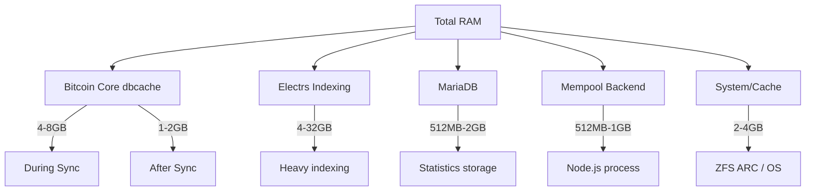

## Overview

Mempool has different hardware requirements depending on your deployment scale and intended use. This guide covers requirements for various deployment scenarios from basic home setups to enterprise production instances.

<Warning>
  Mempool v3 is powered by [mempool/electrs](https://github.com/mempool/electrs) which requires significant resources for indexing. Plan your hardware accordingly.
</Warning>

## Deployment Scales

<CardGroup cols={3}>
  <Card title="Basic" icon="house">
    Perfect for home users and hobbyists
  </Card>
  <Card title="Advanced" icon="building">
    For small to medium production instances
  </Card>
  <Card title="Enterprise" icon="tower-broadcast">
    High-performance public-facing deployments
  </Card>
</CardGroup>

## Basic Self-Hosting (Docker/One-Click)

### Minimum Requirements

Suitable for Docker deployments and one-click installations on node distros like Umbrel, RaspiBlitz, and StartOS.

<AccordionGroup>
  <Accordion title="Hardware Specifications">
    - **CPU**: 4 cores (ARM64 or x86_64)
    - **RAM**: 4GB minimum, 8GB recommended
    - **Storage**: 1TB SSD (NVMe recommended)
    - **Network**: 100 Mbps connection
  </Accordion>
  
  <Accordion title="Software Dependencies">
    - **Bitcoin Core**: v22.0+ with `txindex=1`
    - **Electrum Server** (optional): For address lookups
      - [romanz/electrs](https://github.com/romanz/electrs)
      - [Fulcrum](https://github.com/cculianu/Fulcrum)
      - [mempool/electrs](https://github.com/mempool/electrs)
    - **MariaDB**: v10.5 or later
    - **Node.js**: v20.x or later
    - **Rust**: Latest stable (for building)
  </Accordion>
  
  <Accordion title="Storage Breakdown">
    | Component | Space Required | Notes |
    |-----------|----------------|-------|
    | Bitcoin Core (blocks) | ~600GB | Blockchain data |
    | Bitcoin Core (chainstate) | ~10GB | UTXO set |
    | Bitcoin Core (txindex) | ~50GB | Transaction index |
    | Electrum Server | ~50-100GB | Address indexing |
    | MariaDB | ~5-10GB | Mempool statistics |
    | Mempool cache | ~5-10GB | Application data |
    | **Total** | **~750GB-850GB** | Plus growth room |
  </Accordion>
</AccordionGroup>

<Info>
  **Raspberry Pi Users**: A Raspberry Pi 4 (8GB RAM) with a 1TB SSD can run Mempool, but initial sync times will be longer. Consider pre-synced solutions like Umbrel or RaspiBlitz.
</Info>

## Advanced Self-Hosting

### Recommended Specifications

For users running small to medium production instances or serving a community.

```yaml Hardware Profile
CPU:
  Cores: 8-12 cores
  Type: Modern Intel/AMD x86_64 or ARM64
  
Memory:
  Minimum: 16GB RAM
  Recommended: 32GB RAM
  Note: More RAM = better performance for electrs indexing
  
Storage:
  Disk Type: NVMe SSD (Required)
  Capacity: 2TB minimum
  RAID: Optional RAID 1 for redundancy
  
Network:
  Bandwidth: 1 Gbps dedicated
  Traffic: Plan for 500GB-2TB/month
```

### Bitcoin Core Configuration

Optimized `bitcoin.conf` for advanced deployments:

```bash bitcoin.conf
datadir=/bitcoin
server=1
txindex=1
coinstatsindex=1
listen=1
discover=1

# Performance tuning
dbcache=4096        # 4GB cache for initial sync
maxmempool=1337     # ~1.3GB mempool
mempoolexpiry=999999
par=8               # Parallel script verification
maxconnections=100

# RPC Configuration  
rpcallowip=127.0.0.1
rpcuser=mempool
rpcpassword=<STRONG_PASSWORD>
rpcbind=127.0.0.1:8332

# Network optimizations
whitelist=127.0.0.1
blocksxor=0
logtimemicros=1
```

<Tip>
  Set `dbcache` to 50% of available RAM during initial blockchain sync, then reduce to 1024-2048MB after sync completes to free memory for electrs.
</Tip>

### Storage Requirements by Network

<CardGroup cols={2}>
  <Card title="Bitcoin Mainnet" icon="bitcoin">
    - **Blockchain**: ~600GB
    - **Electrs Index**: ~100GB
    - **txindex**: ~50GB
    - **Total**: ~750GB
  </Card>
  
  <Card title="Bitcoin Testnet" icon="flask">
    - **Blockchain**: ~50GB
    - **Electrs Index**: ~10GB
    - **txindex**: ~5GB
    - **Total**: ~65GB
  </Card>
  
  <Card title="Liquid Network" icon="droplet">
    - **Blockchain**: ~25GB
    - **Electrs Index**: ~15GB
    - **txindex**: ~10GB
    - **Total**: ~50GB
  </Card>
  
  <Card title="Signet" icon="signal">
    - **Blockchain**: ~5GB
    - **Electrs Index**: ~2GB
    - **txindex**: ~1GB
    - **Total**: ~8GB
  </Card>
</CardGroup>

## Enterprise Production Instance

### Server Hardware

<Warning>
  This setup is serious infrastructure. Home users should use [one-click installation methods](/self-hosting/node-distros) instead.
</Warning>

Mempool.space runs on enterprise-grade hardware optimized for maximum performance:

```yaml Production Specs (mempool.space)
CPU:
  Cores: 20+ cores (more is better)
  Architecture: x86_64
  Recommendation: AMD EPYC or Intel Xeon
  
Memory:
  Minimum: 64GB RAM
  Recommended: 128GB+ RAM
  Type: ECC DDR4/DDR5
  Use Case: Large ARC cache for ZFS, electrs indexing
  
Storage:
  Type: NVMe SSD in RAID 0 (ZFS striped)
  Configuration: 2x 2TB or 2x 4TB NVMe
  Total Capacity: 4TB minimum
  Filesystem: ZFS with ARC L2 cache
  IOPS: 500K+ read/write
  
Network:
  Connection: 10 Gbps
  IPv6: Required
  Traffic: Plan for 10TB+/month
```

### Operating System

<CodeGroup>
```bash FreeBSD (Recommended)
# mempool.space runs on FreeBSD 13+ with ZFS
# Advantages:
- Native ZFS with excellent ARC cache
- Superior network stack performance
- Better resource management
```

```bash Linux (Alternative)
# Ubuntu Server 22.04 LTS or Debian 12
# Use ZFS on Linux for best performance
sudo apt install zfsutils-linux
```
</CodeGroup>

### ZFS Configuration for Maximum Performance

For enterprise deployments, ZFS with separate datasets provides flexibility:

```bash ZFS Setup
# Create ZFS pool with 2x NVMe SSDs in RAID 0
zpool create -o ashift=12 nvm /dev/nvd0p3 /dev/nvd1p3

# Create separate datasets for flexibility
zfs create nvm/bitcoin
zfs create nvm/bitcoin/blocks
zfs create nvm/bitcoin/chainstate  
zfs create nvm/bitcoin/indexes
zfs create nvm/bitcoin/electrs
zfs create nvm/electrs
zfs create nvm/electrs/mainnet
zfs create nvm/electrs/mainnet/cache
zfs create nvm/electrs/mainnet/history
zfs create nvm/electrs/mainnet/txstore
zfs create nvm/mysql
zfs create nvm/mempool

# Set mount points
zfs set mountpoint=/bitcoin nvm/bitcoin
zfs set mountpoint=/electrs/mainnet nvm/electrs/mainnet
zfs set mountpoint=/mysql nvm/mysql
zfs set mountpoint=/mempool nvm/mempool
```

### Electrs Storage Requirements

The electrs index is the largest component for enterprise deployments:

| Network | History DB | TxStore DB | Cache | Total |
|---------|-----------|-----------|-------|-------|
| Mainnet | ~300GB | ~530GB | ~5MB | ~830GB |
| Testnet | ~19GB | ~38GB | ~2MB | ~57GB |
| Liquid | ~900MB | ~10GB | ~8MB | ~11GB |
| Signet | ~500MB | ~1GB | ~1MB | ~2GB |

<Info>
  These sizes grow over time. Plan for 20-30% growth annually.
</Info>

### Database Requirements

**MariaDB Configuration:**

```sql MariaDB Databases
-- Create separate databases per network
CREATE DATABASE mempool;
GRANT ALL ON mempool.* TO 'mempool'@'localhost' IDENTIFIED BY '<password>';

CREATE DATABASE mempool_testnet;
GRANT ALL ON mempool_testnet.* TO 'mempool_testnet'@'localhost' IDENTIFIED BY '<password>';

CREATE DATABASE mempool_signet;
GRANT ALL ON mempool_signet.* TO 'mempool_signet'@'localhost' IDENTIFIED BY '<password>';

CREATE DATABASE mempool_liquid;
GRANT ALL ON mempool_liquid.* TO 'mempool_liquid'@'localhost' IDENTIFIED BY '<password>';
```

**Storage**: 10-50GB per mainnet instance (grows with historical data)

## Build Dependencies

### All Platforms

<Steps>
  <Step title="Node.js & npm">
    Install Node.js v20.x or later:
    
    ```bash Using nvm (recommended)
    curl -o- https://raw.githubusercontent.com/nvm-sh/nvm/v0.40.0/install.sh | bash
    source ~/.bashrc
    nvm install v20
    nvm alias default node
    ```
  </Step>
  
  <Step title="Rust Toolchain">
    Required for building the backend:
    
    ```bash Install Rust
    curl --proto '=https' --tlsv1.2 -sSf https://sh.rustup.rs | sh
    source $HOME/.cargo/env
    ```
  </Step>
  
  <Step title="System Packages">
    <Tabs>
      <Tab title="Debian/Ubuntu">
        ```bash
        sudo apt-get update
        sudo apt-get install -y git curl wget \
          build-essential pkg-config libssl-dev \
          mariadb-server mariadb-client nginx
        ```
      </Tab>
      
      <Tab title="FreeBSD">
        ```bash
        pkg install -y git curl wget nginx openssl \
          boost-libs autoconf automake gmake gcc \
          libevent libtool pkgconf \
          mariadb105-server mariadb105-client
        ```
      </Tab>
      
      <Tab title="macOS">
        ```bash
        brew install git curl wget nginx openssl \
          mariadb pkg-config
        ```
      </Tab>
    </Tabs>
  </Step>
</Steps>

## Performance Considerations

### Disk I/O Requirements

<CardGroup cols={2}>
  <Card title="Basic Setup" icon="gauge-simple">
    **SSD Required**
    
    - SATA SSD: Acceptable
    - NVMe: Better
    - IOPS: 10K+ read/write
  </Card>
  
  <Card title="Enterprise Setup" icon="gauge-max">
    **NVMe Required**
    
    - NVMe Gen3+: Required  
    - RAID 0: Recommended
    - IOPS: 500K+ read/write
  </Card>
</CardGroup>

<Warning>
  **Never use HDD for any Mempool component.** Electrs will be unusably slow and Bitcoin Core sync will take weeks instead of days.
</Warning>

### Memory Usage Patterns



### CPU Usage

- **Initial Sync**: 100% CPU utilization (signature verification)
- **Normal Operation**: 5-20% average
- **Peak Load**: 40-60% during block validation
- **Electrs Indexing**: 80-100% CPU per core

## Network Requirements

### Bandwidth Estimates

| Deployment Scale | Monthly Bandwidth | Peak Traffic |
|------------------|-------------------|-------------|
| Personal Use | 50-100GB | ~1 Mbps |
| Small Community | 200-500GB | ~5 Mbps |
| Public Instance | 2-10TB | ~100 Mbps |
| Enterprise (mempool.space) | 50TB+ | ~5 Gbps |

### Port Requirements

<CodeGroup>
```bash Bitcoin Core
8332/tcp  # RPC (localhost only)
8333/tcp  # P2P (public)
8334/tcp  # ZMQ rawblock
8335/tcp  # ZMQ rawtx
```

```bash Electrum Server  
50002/tcp # Electrs RPC (localhost only)
3000/tcp  # Esplora HTTP API
```

```bash Mempool Backend
8999/tcp  # Backend API (localhost only)
```

```bash Web Server
80/tcp    # HTTP
443/tcp   # HTTPS
```
</CodeGroup>

## Sync Time Estimates

<Note>
  These are approximate times with good hardware and network connection:
</Note>

### Bitcoin Core Initial Sync

- **Fast Hardware** (NVMe, 8+ cores): 6-12 hours
- **Good Hardware** (SSD, 4 cores): 1-3 days  
- **Slow Hardware** (SATA SSD, 2 cores): 3-7 days
- **Very Slow** (HDD): Don't even try

### Electrs Initial Indexing

- **Enterprise** (NVMe RAID, 64GB RAM): 12-24 hours
- **Advanced** (NVMe, 32GB RAM): 2-4 days
- **Basic** (SSD, 16GB RAM): 5-10 days
- **Raspberry Pi 4**: 2-4 weeks

<Tip>
  You can use Mempool without an Electrum Server, but address lookups will be disabled. Add electrs later if needed.
</Tip>

## Next Steps

<CardGroup cols={2}>
  <Card 
    title="Node Distros"
    icon="cube"
    href="/self-hosting/node-distros"
  >
    One-click installations for home users
  </Card>
  
  <Card 
    title="Scaling Guide"
    icon="arrow-up-right-dots"
    href="/self-hosting/scaling"
  >
    Performance tuning and optimization
  </Card>
  
  <Card 
    title="Docker Setup"
    icon="docker"
    href="/installation/docker"
  >
    Deploy with Docker Compose
  </Card>
  
  <Card 
    title="Maintenance"
    icon="wrench"
    href="/self-hosting/maintenance"
  >
    Backup, updates, and monitoring
  </Card>
</CardGroup>
